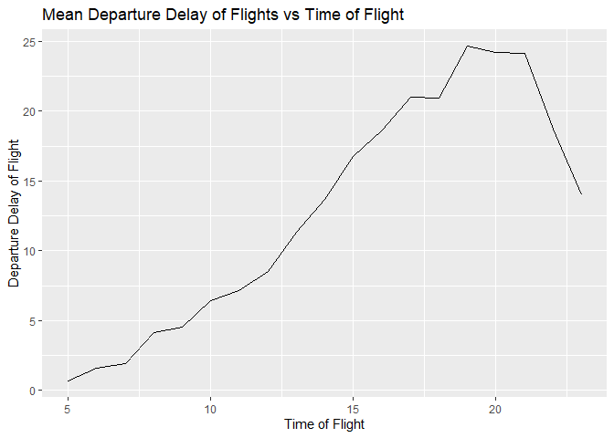
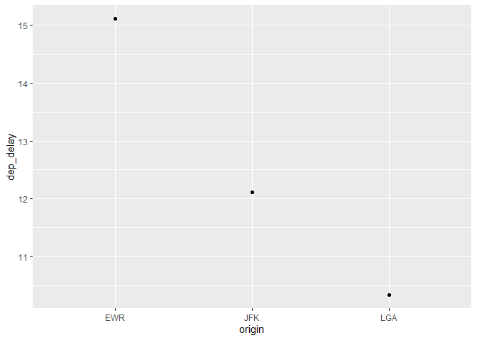
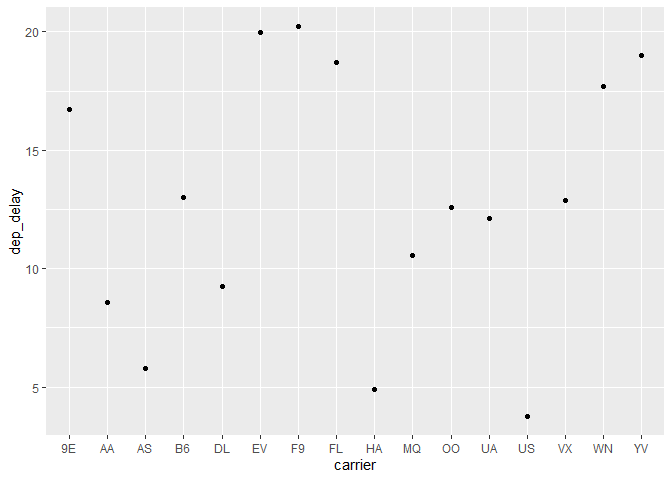

HW2
================
Lejun Xu
2022-10-13

Q: What time of day should you fly if you want to avoid delays as much
as possible? Does this choice depend on anything? Season? Weather?
Airport? Airline? Find three patterns.

``` r
library(dplyr)
```

    ## 
    ## 载入程辑包：'dplyr'

    ## The following objects are masked from 'package:stats':
    ## 
    ##     filter, lag

    ## The following objects are masked from 'package:base':
    ## 
    ##     intersect, setdiff, setequal, union

``` r
library(tidyverse)
```

    ## -- Attaching packages --------------------------------------- tidyverse 1.3.1 --

    ## v ggplot2 3.3.5     v purrr   0.3.4
    ## v tibble  3.1.6     v stringr 1.4.0
    ## v tidyr   1.2.0     v forcats 0.5.1
    ## v readr   2.1.2

    ## -- Conflicts ------------------------------------------ tidyverse_conflicts() --
    ## x dplyr::filter() masks stats::filter()
    ## x dplyr::lag()    masks stats::lag()

``` r
library(nycflights13)
```

    ## Warning: 程辑包'nycflights13'是用R版本4.1.3 来建造的

``` r
library(ggplot2)
```

``` r
flights
```

    ## # A tibble: 336,776 x 19
    ##     year month   day dep_time sched_dep_time dep_delay arr_time sched_arr_time
    ##    <int> <int> <int>    <int>          <int>     <dbl>    <int>          <int>
    ##  1  2013     1     1      517            515         2      830            819
    ##  2  2013     1     1      533            529         4      850            830
    ##  3  2013     1     1      542            540         2      923            850
    ##  4  2013     1     1      544            545        -1     1004           1022
    ##  5  2013     1     1      554            600        -6      812            837
    ##  6  2013     1     1      554            558        -4      740            728
    ##  7  2013     1     1      555            600        -5      913            854
    ##  8  2013     1     1      557            600        -3      709            723
    ##  9  2013     1     1      557            600        -3      838            846
    ## 10  2013     1     1      558            600        -2      753            745
    ## # ... with 336,766 more rows, and 11 more variables: arr_delay <dbl>,
    ## #   carrier <chr>, flight <int>, tailnum <chr>, origin <chr>, dest <chr>,
    ## #   air_time <dbl>, distance <dbl>, hour <dbl>, minute <dbl>, time_hour <dttm>

``` r
# time factor
time_dep_delay <- flights %>%
  drop_na() %>%
  group_by(hour) %>%
  summarise(mean_dep_delay =mean(dep_delay,na.rm = TRUE))
 arrange(time_dep_delay)
```

    ## # A tibble: 19 x 2
    ##     hour mean_dep_delay
    ##    <dbl>          <dbl>
    ##  1     5          0.689
    ##  2     6          1.60 
    ##  3     7          1.91 
    ##  4     8          4.11 
    ##  5     9          4.54 
    ##  6    10          6.45 
    ##  7    11          7.15 
    ##  8    12          8.52 
    ##  9    13         11.3  
    ## 10    14         13.7  
    ## 11    15         16.8  
    ## 12    16         18.6  
    ## 13    17         21.0  
    ## 14    18         21.0  
    ## 15    19         24.7  
    ## 16    20         24.2  
    ## 17    21         24.2  
    ## 18    22         18.7  
    ## 19    23         14.0

``` r
ggplot(time_dep_delay,aes(y=mean_dep_delay,x=hour)) +
  geom_line()+
  labs(x = "Time of Flight",
       y = "Departure Delay of Flight",
       title = "Mean Departure Delay of Flights vs Time of Flight",
      )
```

<!-- --> Based on the
table and plot above, we find that we can book the flight from 5 to 9 in
the morning to avoid delays as much as possible.

``` r
#Airport factor
airports<- flights %>%
  drop_na() %>%
  group_by(origin) %>%
  summarise(mean_dep_delay =mean(dep_delay,na.rm = TRUE,))
  arrange(airports)
```

    ## # A tibble: 3 x 2
    ##   origin mean_dep_delay
    ##   <chr>           <dbl>
    ## 1 EWR              15.0
    ## 2 JFK              12.0
    ## 3 LGA              10.3

``` r
flights %>%
  group_by(origin) %>%
    summarise(dep_delay = mean(dep_delay, na.rm = TRUE)) %>%
  ggplot(aes(x = origin, y = dep_delay)) +
  geom_point()
```

<!-- -->

We find that LGA airport has the least delay flights, while the EWR
airport has the longest delay flights.

``` r
# Airline factor
airlines<- flights %>%
  drop_na() %>%
  group_by(carrier) %>%
  summarise(mean_dep_delay =mean(dep_delay,na.rm = TRUE,))
  arrange(airlines)
```

    ## # A tibble: 16 x 2
    ##    carrier mean_dep_delay
    ##    <chr>            <dbl>
    ##  1 9E               16.4 
    ##  2 AA                8.57
    ##  3 AS                5.83
    ##  4 B6               13.0 
    ##  5 DL                9.22
    ##  6 EV               19.8 
    ##  7 F9               20.2 
    ##  8 FL               18.6 
    ##  9 HA                4.90
    ## 10 MQ               10.4 
    ## 11 OO               12.6 
    ## 12 UA               12.0 
    ## 13 US                3.74
    ## 14 VX               12.8 
    ## 15 WN               17.7 
    ## 16 YV               18.9

``` r
flights %>%
  group_by(carrier) %>%
    summarise(dep_delay = mean(dep_delay, na.rm = TRUE)) %>%
  ggplot(aes(x = carrier, y = dep_delay)) +
  geom_point()
```

<!-- -->

We find that US Airways, Hawaiian Airlines and Alaska Airlines are three
airlines with less delay, while ExpressJet Airlines and Southwest
Airlines are the airlines who have huge amount of delay in flights.
